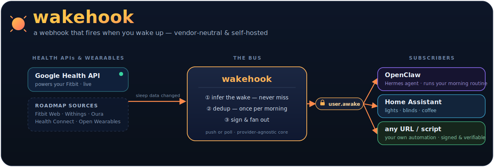

<div align="center">

# ⏰ wakehook

**A self-hosted webhook that fires when you wake up.**



[](https://www.npmjs.com/package/wakehook)
[](https://github.com/robbeverhelst/wakehook/pkgs/container/wakehook)


</div>

---

wakehook is a small self-hosted service that turns your sleep data (Google Health / Fitbit) into a
signed `user.awake` webhook. It reads your sleep from the Google Health API, infers the moment you
woke up, and POSTs a neutral event to whatever you point it at — an AI agent (OpenClaw, Hermes), a
smart-home hub, or any URL. It fires at most once per morning.

It is vendor-neutral by design: wakehook states a fact ("woke at 07:03") and signs it; each
subscriber decides what to do with it. The core — inference, dedup, fan-out — knows nothing about
any specific consumer.

## Why it exists

Google Health's own webhook can't drive an agent or smart home directly:

- **Semantics** — it means "sleep data changed", and also fires for naps, mid-night syncs, and
  edits. Something has to fetch the session and infer the actual wake.
- **Payload** — Google sends `{operation, healthUserId, intervals}`; your consumer expects its own
  shape.
- **Handshake** — Google requires an ownership-verification challenge and a `204` ack with 7-day
  retries that a typical consumer endpoint won't implement.

wakehook handles all three and emits one clean, signed event.

## How it works

wakehook fires on the first sleep session that is the **main** sleep, **ends today** inside a
configurable **morning window**, is **long enough**, and **hasn't already fired today**. A later
split-night session supersedes once, which heals Fitbit's occasional split logs. Thresholds are all
configurable; the goal is to never miss a wake and to fire as soon as the data arrives.

Two ingestion modes:

- **poll** (default) — wakehook pulls the Google Health API on a timer, only around the morning
  window, and stops once it has fired for the day. No inbound URL or open port; wake is detected
  within one poll interval.
- **webhook** (experimental) — Google pushes to wakehook's `/webhook`. Instant, but needs a public
  HTTPS endpoint and is not yet verified end-to-end.

## ☕ Example

Point wakehook at two subscribers and your morning runs itself. When it detects you woke at 07:03,
it fires once and fans out:

- **OpenClaw** gets the nudge and runs your routine — checks the calendar and weather, summarizes
  overnight messages, and sends you a briefing.
- **Home Assistant** gets the signed event and turns on the bedroom lights and the coffee machine.

No matter how many times your phone re-syncs that morning, it only fires once.

## 🚀 Quick start

**Requirements:** [Bun](https://bun.sh) ≥ 1.3 (wakehook is Bun-only — it imports `bun:sqlite`), and
a Google Cloud project with the Health API enabled, an OAuth 2.0 client (id + secret), and the
`googlehealth.sleep.readonly` scope (see [Google setup](#google-setup)).

**1. Install**

```bash
bunx wakehook                 # or: bun add wakehook
# or Docker:
docker run -v wakehook-data:/data --env-file .env ghcr.io/robbeverhelst/wakehook
```

**2. Configure** — create `config.json` in the working directory:

```json
{
  "dbPath": "./wake.sqlite",
  "source": "google-health",
  "inference": {
    "timezone": "Europe/Brussels",
    "windowStart": "04:00",
    "windowEnd": "11:00",
    "minDurationMin": 180,
    "supersedeGapMin": 45
  },
  "google": { "mode": "poll", "pollIntervalMs": 300000, "pollLookbackMin": 720, "pollWindowOnly": true, "pollWindowMarginMin": 30 },
  "subscribers": [
    { "id": "openclaw", "url": "http://localhost:18789/hooks/wakehook", "headers": { "Authorization": "Bearer <openclaw-hooks-token>" } }
  ]
}
```

…and a `.env` with the OAuth credentials (keep secrets out of `config.json`):

```bash
GOOGLE_CLIENT_ID=...
GOOGLE_CLIENT_SECRET=...
GOOGLE_REDIRECT_URI=http://localhost:8080/oauth/callback
```

**3. Authorize once** — opens a Google consent URL, then stores a refresh token (auto-refreshed
afterward):

```bash
bunx wakehook-auth            # from source: bun run auth
```

**4. Run it** — polls Google around the morning window and fans the signed `user.awake` out to your
subscribers, once per morning:

```bash
bunx wakehook                 # from source: bun run start
```

A shorter `pollIntervalMs` (2–5 min) detects the wake faster; with `pollWindowOnly` it stays cheap.
Set `pollWindowOnly: false` to poll 24/7.

### Test without waiting for morning

```bash
curl -X POST http://localhost:8080/test/replay \
  -H 'Content-Type: application/json' \
  -d '{}'    # fires a synthetic wake now; pass {"end":"...","durationMin":420} to control it
```

### Webhook mode (experimental)

Set `"mode": "webhook"`, set `webhookAuthToken` (env `GOOGLE_WEBHOOK_AUTH_TOKEN`), expose
`/webhook` over public HTTPS (Cloudflare Tunnel / reverse proxy / VPS — wakehook makes no ingress
assumptions), and register a Google Health sleep webhook subscription pointing at it. The poll path
is verified end-to-end; the webhook notification parsing and subscription-creation step are not yet
verified — prefer poll unless you're ready to wire and test the push contract.

## The event

```http
POST <subscriber-url>
X-Wake-Signature: sha256=<hmac of body with the subscriber's secret>   # only if "secret" is set
X-Wake-Event-Id: <user>:<wokeAt>

{ "event": "user.awake", "wokeAt": "2026-06-14T07:03:00+02:00",
  "user": "<healthUserId>", "source": "google-health",
  "session": { "start": "...", "end": "...", "durationMin": 431 } }
```

Every subscriber receives the same neutral event. Per-subscriber options:

- `secret` — when set, the body is HMAC-SHA256 signed so the receiver can verify it.
- `signatureHeader` (default `X-Wake-Signature`) and `signatureFormat` (`prefixed` → `sha256=<hex>`,
  or `hex` → bare) — set these to match a receiver's expected header.
- `headers` — extra request headers for a receiver's own auth, e.g. `{ "Authorization": "Bearer <token>" }`.

## 🤖 Connecting an agent

One [`SKILL.md`](./SKILL.md) walks an agent through the whole setup (install, configure, authorize,
run, wire the hook) for both agents below:

```bash
# OpenClaw
openclaw skills install git:robbeverhelst/wakehook   # or via ClawHub: openclaw skills install wakehook
# Hermes Agent (zero-infra tap)
hermes skills tap add robbeverhelst/wakehook
```

- **OpenClaw** — point `url` at a [mapped hook](https://docs.openclaw.ai/gateway/configuration-reference)
  (`/hooks/<name>`), pass the gateway hook token via `headers`, and define a `hooks.mappings` entry
  with `action: "wake"` + `textTemplate`.
- **[Hermes Agent](https://hermes-agent.nousresearch.com/docs/user-guide/messaging/webhooks)** —
  point `url` at a webhook route (`:8644/webhooks/<route>`), set `secret` to the route secret with
  `signatureHeader: "X-Webhook-Signature"` and `signatureFormat: "hex"`, and give the route a
  `prompt` template. On loopback you can skip signing with `INSECURE_NO_AUTH`.

## Google setup

1. Create a Google Cloud project, enable the Health API, configure the OAuth consent screen, and add
   yourself as a test user. Scope: `googlehealth.sleep.readonly`.
2. Publish the app to **"In Production"** (still unverified, 100-user cap — fine for personal use) so
   the refresh token doesn't expire after 7 days, which is the "Testing" default.

## Adding a source

Google Health is the first `Source`; the core is provider-agnostic, so a new provider touches no
core code:

1. Implement the `Source` interface (`src/types.ts`) under `src/sources/<name>/`. A source declares
   a `webhook` capability (the provider POSTs to `/webhook`), a `poll` capability (wakehook polls it
   on a timer), or both.
2. Register it with one line in `src/sources/registry.ts`.
3. Select it with `"source": "<name>"` in config.

The server mounts `/webhook` only for push sources; the scheduler drives poll sources. Google Health
implements both, selectable via `google.mode`.

## Built with

Bun, [Hono](https://hono.dev), and `bun:sqlite` — a single portable service, shipped as a Docker
image, configured with a JSON file plus env vars. Core logic is unit tested (`bun test`). See
[`DESIGN.md`](./DESIGN.md) for the rationale and decision log.

## License

MIT
